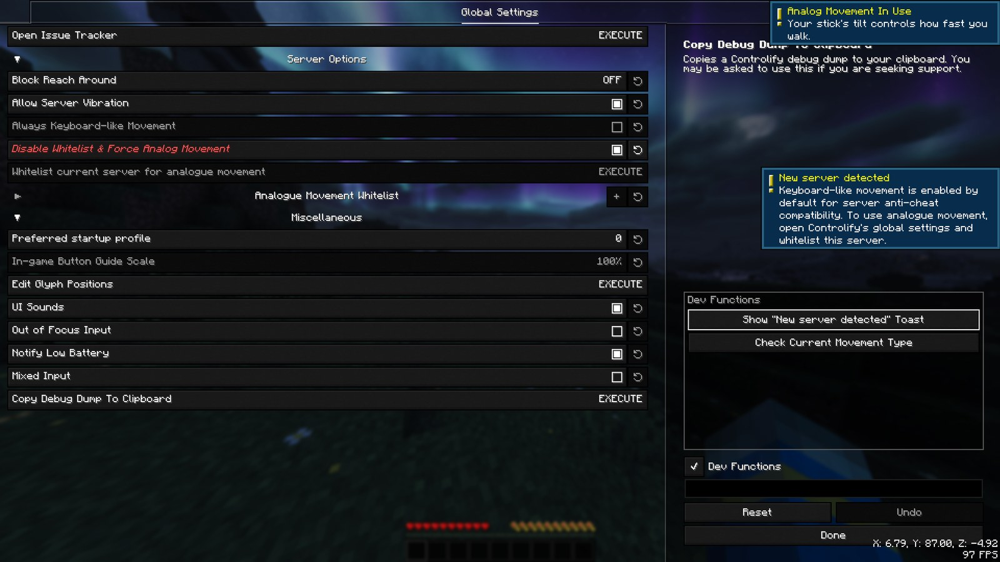
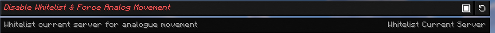
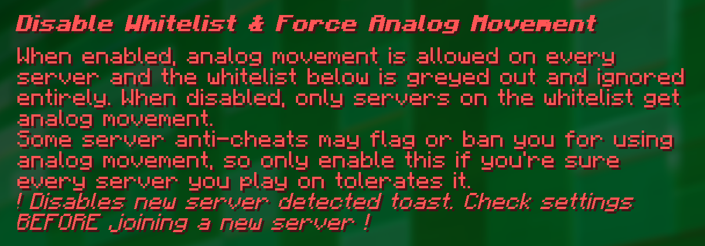
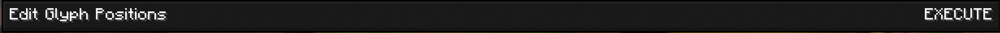
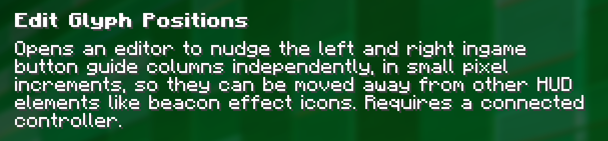
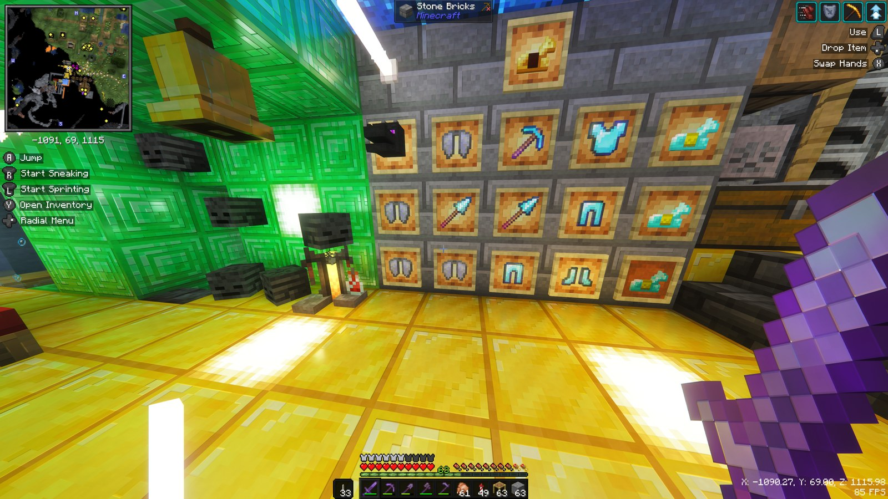
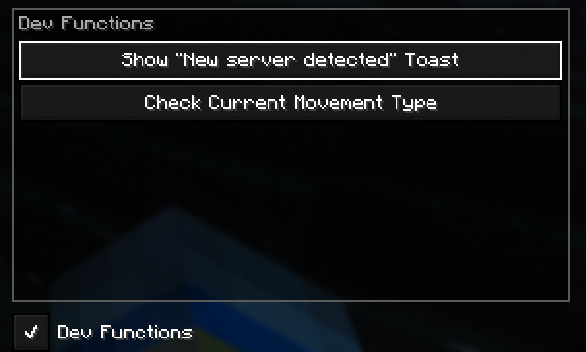
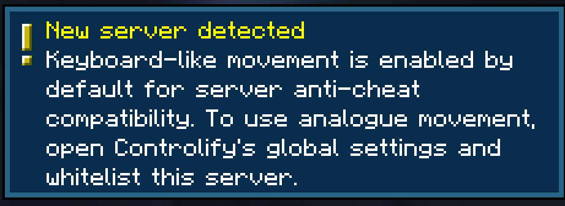

A mod that adds the best **controller support** for Minecraft: Java Edition.

## What's different in this fork

This is an unofficial custom build of isXander's Controlify. It adds new options and a **Dev Functions** panel to Controlify's **Global Settings** screen, fixes a virtual mouse bug that is suspected to also affect the official 26.3 release, and removes the "New server detected" toast on Realms. Everything else works the same as the official mod.

### Disable Whitelist & Force Analog Movement

Turns on analog movement (walking speed follows how far you tilt the stick) on every server, instead of only on servers in the Analogue Movement Whitelist. While it's on, the whitelist is greyed out and ignored, and the "New server detected" toast no longer appears.

> **Warning:** some server anti-cheats may flag or ban you for using analog movement. Only turn this on if you're sure every server you play on allows it, and check it *before* joining a new server.

### Edit Glyph Positions

Opens an editor for moving the left and right in-game button guide columns separately, in small pixel steps. You can type exact offsets, snap each side to a screen corner, or reset it. Handy for moving the guides out of the way of other HUD elements, like beacon effect icons. Requires a connected controller.

### Dev Functions panel

A panel on the right-hand side of Global Settings with test buttons:

- **Show "New server detected" Toast** pops up that toast exactly as it appears in game.
- **Check Current Movement Type** shows a toast telling you whether analog movement or keyboard-like movement (full speed only, like WASD) is active right now.

The **Dev Functions** checkbox below the panel hides it. While hidden, its buttons can't be clicked, and your choice is remembered.

### Virtual mouse fix

Fixes a bug that is suspected to also affect the official 26.3 release: after touching the mouse while the inventory (or another screen with the virtual mouse) was open, going back to the controller made the virtual cursor snap to the center of the screen and jitter, repeatedly showed the "Controller disabled" toast, and stopped B from closing the screen. The virtual mouse now picks up where your real mouse was, and switching between mouse and controller works normally.

### No more "New server detected" toast on Realms

Controlify already allows analog movement on Realms, but the official version still showed the "New server detected" toast (which says keyboard-like movement is on) the first time you joined one. This build only shows that toast when keyboard-like movement is actually in use, so it no longer appears on Realms or on servers already in your whitelist.

## [Wiki](https://moddedmc.wiki/project/controlify)

Read up on the [Controlify Wiki](https://controlify.isxander.dev) for more information on how to use Controlify, how to configure it, and how to develop for it.

## What is Controlify?

Controlify is the best controller support mod for Minecraft: Java Edition. It exceeds the first-party Bedrock Edition controller support in every way possible. It is feature-complete, with support for vibration, gyroscope, HD haptics, and more.

Controlify supports *all* controllers, thanks to its usage of the [SDL3](https://libsdl.org/) library, which is the most advanced cross-platform input library available. 

Controlify is designed to be both user-friendly and feature-rich. It has sensible defaults, with default sensitivity matched to Bedrock Edition for easy transition, and a simple yet informative settings screen that allows you to tweak your experience to your liking.

## Feature overview

- **Vibration & DualSense HD haptics**, with per-event intensity and **adaptive trigger** effects.
- **Gyro aiming**, with optional flick stick.
- **Full GUI navigation** of every menu, including inventories and modded screens, with cursor snapping.
- **Works with all controllers** via SDL3, including PlayStation controllers without extra software, **Steam Deck**, flight sticks and racing wheels.
- **Vendor-specific inputs** like paddles, mute buttons and touchpads on Xbox, DualSense and Steam Deck.
- **Controller-specific button glyphs**, detected automatically.
- **On-screen keyboard** and a configurable **radial menu**.
- **Data-driven**: resource packs can change bindings, glyphs, button guides, keyboard layouts and controller models.
- **Mod compatibility** with Sodium, Iris, Simple Voice Chat, Do A Barrel Roll and more.
- **Fabric and NeoForge**, Minecraft 1.21.1 and above. Snapshot builds are available to isXander's Patreon members.

## Features

### Controller vibration
Vibration for events like taking damage, something not even Bedrock on Windows has. Each source's intensity can be adjusted.

### Radial menu
Put less-used actions, including any modded keybind, on a customizable radial menu to free up buttons.

### Gyro support
Use your controller's gyroscope for fine aiming, optionally combined with [flick stick](https://www.reddit.com/r/gamedev/comments/bw5xct/flick_stick_is_a_new_way_to_control_3d_games_with/).

### Container cursor
A Bedrock-style inventory cursor with cursor snapping and dedicated buttons for quick move, dropping and more.

### Controller identification & joysticks
Your controller's make and model is detected automatically to show matching button glyphs. Resource packs can add new styles and controllers. Any joystick can be mapped with your own names and textures, with unlimited inputs.

### Button guide
An in-game overlay shows which buttons you can press right now, and menus show button hints on elements with controller shortcuts.

### Built for mod compatibility
Each controller has its own settings and bindings, and a simple API lets other mods add controller support for their own screens.

<i>Do A Barrel Roll with a Thrustmaster HOTAS flightstick</i>

### Automatic deadzone calibration
Your controller's deadzones are calibrated automatically.

## Supported versions
Controlify requires Minecraft **1.19.4** or newer, because that's when Mojang added the keyboard navigation it builds on. It is actively supported for **1.21.1 and above** on Fabric and NeoForge.
