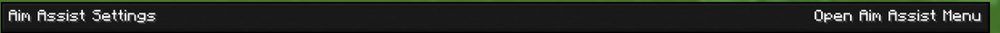
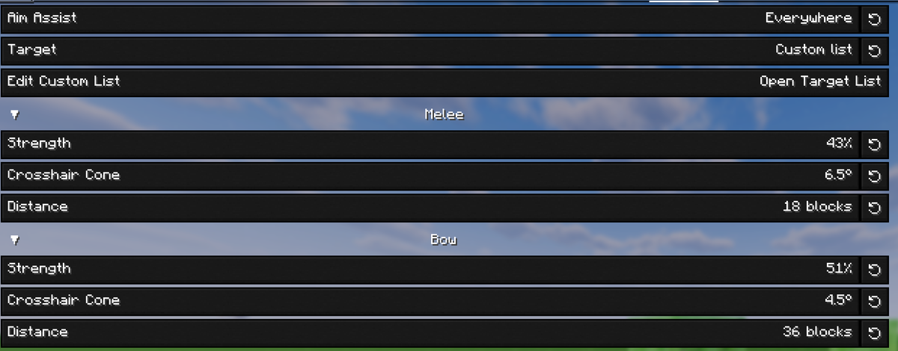
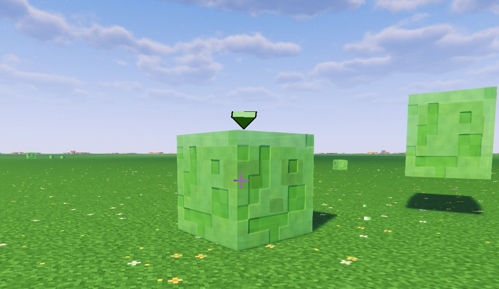
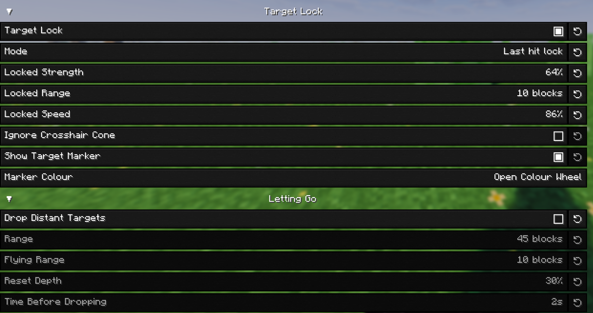
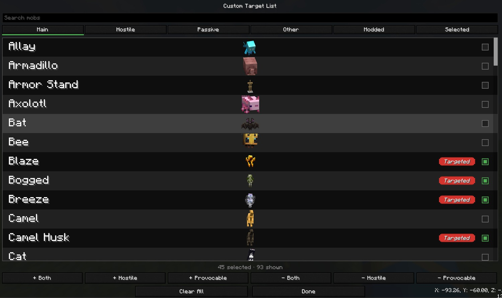
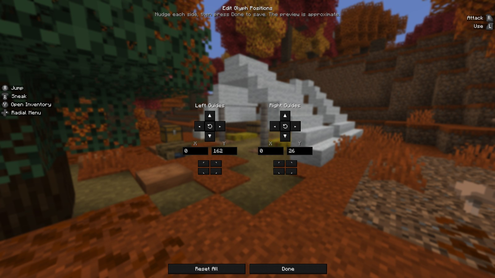

<div align="center">


**An unofficial custom build of [Controlify](https://github.com/isXander/Controlify), the controller support mod for Minecraft: Java Edition.**

[](https://patreon.com/isxander)

</div>

---

## What's different in this fork

This build adds three options to Controlify's **Global Settings** screen, fixes two annoyances, and includes a small panel for testing. Everything else behaves exactly like the official mod.

**New options**

- [Aim assist](#aim-assist) — controller aim assist for melee and bows, with target lock and a custom target list, off by default
- [Edit Glyph Positions](#edit-glyph-positions) — move the in-game button guides out of the way
- [Disable Whitelist & Force Analog Movement](#disable-whitelist--force-analog-movement) — analog movement on every server

**Fixes**

- ["New server detected" toast](#new-server-detected-toast) — no longer shown when it doesn't apply
- [Virtual mouse](#virtual-mouse) — no more cursor snapping to the centre after you touch the mouse

**Testing**

- [Dev Functions panel](#dev-functions-panel) — a small panel for triggering things on demand

<p align="center">
  
  <br>
  <em>The Global Settings screen in this build.</em>
</p>

---

## New options

### Aim assist

Opens a screen of aim assist settings. With it on, the look stick slows down as your crosshair comes onto a mob and pulls gently towards its upper chest, which is where most controller misses come from — overshooting rather than being wildly off. It keeps tracking while you strafe past something, not only while you're turning.

It only scales the look input you are already giving. It never moves the camera on its own, never widens a hitbox, and never changes where an attack lands. Your own aim still decides the outcome.

<p align="center">
  
</p>

**Aim Assist** — off, **Singleplayer & LAN**, or **Everywhere**.

> [!WARNING]
> Many servers treat any aim assist as an unfair advantage, whatever the implementation. Only use **Everywhere** on servers you know allow it. **Singleplayer & LAN** is the default and never touches a multiplayer server.

**Target** — hostile mobs, all mobs, or a custom list. Hostile mobs also covers a normally peaceful mob that's currently angry, like a provoked wolf pack. Players are never targeted.

**Melee** and **Bow** are tuned separately, each with three settings:

- **Strength** — how hard the assist slows your look input and pulls towards a target, as a percentage. 0 does nothing at all; higher slows harder and pulls further each tick.
- **Crosshair Cone** — how far off a mob can be before the assist takes an interest, in degrees. Measured from the edge of the mob rather than its centre, so the crosshair anywhere on it counts as zero.
- **Distance** — how far away a mob can be and still be helped with, in blocks.

Melee covers everything except lining up a projectile shot, including while a crossbow is reloading. Bow takes over while you're drawing a bow or holding a loaded crossbow, and is deliberately gentler and tighter — it never leads a shot and never compensates for arrow drop.

The settings are global rather than per-controller.

<p align="center">
  
  <br>
  <em>Melee and bow are tuned independently.</em>
</p>

#### Target lock

Holds one mob as your target instead of aim assist picking whichever is nearest your crosshair each tick. Bind **Lock Target** under Gameplay in Controller Bindings: tap to lock the nearest mob or move to the next, hold to let go. It never moves your camera on its own.

It follows the **Aim Assist** setting above, so it won't run anywhere aim assist isn't allowed.

<p align="center">
  
  <br>
  <em>The marker sits over the head of whatever is locked.</em>
</p>

**Mode** decides how a target comes to be locked:

- **Keybind lock** — nothing is ever locked for you. The bind locks the nearest target, moves to the next one, and lets go when held.
- **Last hit lock** — the bind still works, and on top of that, hitting a mob in melee or with your own arrow takes the lock over, as does a mob hitting you. A mob that *shoots* you only takes the lock when there's nothing else worth locking, so a skeleton across the ravine can't pull you off the creeper in front of you.
- **Marker only** — the bind behaves the same, but aim assist is switched off entirely. Just the marker, and no aim help of any kind.

While a target is locked, three settings stand in for the melee and bow ones:

- **Locked Strength** — how hard the assist slows and pulls.
- **Locked Range** — how far a locked mob can be and still get help, and how far the bind can reach to lock one in the first place.
- **Locked Speed** — how quickly the assist closes the angle still left. Strength is how hard it pulls; this is how fast it settles onto the mob.

**Show Target Marker** draws a marker over the head of whatever is locked — solid while you have line of sight to it, faded when something is in the way. **Marker Colour** opens a colour wheel: drag around the wheel for the shade, and use the column beside it for brightness.

<p align="center">
  
  <br>
  <em>The Letting Go sliders stay greyed out until Drop Distant Targets is on.</em>
</p>

**Ignore Crosshair Cone** takes the angle limit off entirely: the assist pulls towards your locked target from any angle, and keeps pulling even when you and the mob are both standing still. It still only reaches as far as **Locked Range**, and still only ever moves your aim towards the one mob you locked.

> [!WARNING]
> This tracks a mob for you rather than helping with aim you are already making. That is an unfair advantage over players without Controlify, and many anti-cheats will likely flag you for it. Use it in singleplayer, or somewhere everyone playing knows you have it and is fine with it.

**Letting Go** decides when a lock breaks on its own. With **Drop Distant Targets** off, a lock is only let go when the mob dies or you clear it yourself. Turn it on and four settings become available:

- **Range** — how far you can get from a mob that walks before the drop timer starts.
- **Flying Range** — the same for a mob that flies. They cover ground quickly and are usually further off, so they get more room.
- **Reset Depth** — how far back inside the boundary you have to come for the timer to reset, as a share of the range. Without it, a mob chasing you across the line would restart the count every few steps.
- **Time Before Dropping** — how long you can stay outside the boundary before the lock is let go.

The boundary follows the mob, so it moves as the mob does. These ranges only ever let a target go — they have no say in what you can lock in the first place.

#### Custom target list

Setting **Target** to **Custom list** enables **Open Target List**, a picker holding every entity type in the game, modded ones included.

Search by name, or use the tabs: **Main** for the mobs, **Hostile** and **Passive** for the two halves of those, **Other** for everything that isn't a mob, **Modded** for anything not from Minecraft, and **Selected** for what you've already ticked. In a world every row draws the actual mob rather than an icon.

Six buttons along the bottom fill the list in bulk — `+ Both`, `+ Hostile` and `+ Provocable` to add, and the same three with `-` to take them back out. Provocable means the passive mobs that fight back when you hurt them: wolf, bee, panda, dolphin, llama, trader llama, polar bear and iron golem.

<p align="center">
  
  <br>
  <em>Every entity type in the game, with the mobs drawn live.</em>
</p>

### Edit Glyph Positions

Opens an editor for moving the left and right in-game button guide columns separately, in small pixel steps. Type exact offsets, snap either side to a screen corner, or reset it. Handy for keeping the guides clear of other HUD elements, like beacon effect icons.

Requires a connected controller.

<p align="center">
  
  <br>
  
</p>

<p align="center">
  
  <br>
  <em>The editor. Nudge a side, type an exact offset, or snap it to a corner.</em>
</p>

<p align="center">
  
  <br>
  <em>Both guide columns nudged clear of the map and the beacon powers.</em>
</p>

### Disable Whitelist & Force Analog Movement

Turns on analog movement — walking speed follows how far you tilt the stick — on **every** server, instead of only the ones in the Analogue Movement Whitelist. While it's on, the whitelist is greyed out and ignored, and the "New server detected" toast never appears.

> [!WARNING]
> Some server anti-cheats may flag or ban you for using analog movement. Only turn this on if you're sure every server you play on allows it, and check it *before* joining a new server.

<p align="center">
  
  <br>
  
</p>

---

## Fixes

### "New server detected" toast

Controlify already allows analog movement on Realms, but the official version still shows the "New server detected" toast, which says keyboard-like movement is on, even though it isn't. Whitelisting the Realm doesn't stop it: a Realm gets a new address every time it closes and reopens, so the entry you saved is dead by your next session and the toast is back.

This build only shows the toast when keyboard-like movement is actually in use, so it no longer appears on Realms or on servers already in your whitelist.

<p align="center">
  
</p>

### Virtual mouse

In the official build, touching the mouse while the inventory (or another screen with the virtual mouse) was open left the controller in a bad state: going back to it snapped the virtual cursor to the centre of the screen and made it jitter, repeatedly showed the "Controller disabled" toast, and stopped B from closing the screen.

The virtual mouse now picks up where your real mouse was, and switching between mouse and controller works normally. This bug is suspected to affect the official 26.3 release too.

---

## Testing

### Dev Functions panel

A dev panel in Global Settings for faster testing and bug checking, so behaviour can be triggered on demand instead of waiting for it in game. Four buttons:

- **Show "New server detected" Toast** — pops up the toast exactly as it appears in game.
- **Check Aim Assist Target** — reports the mob aim assist is tracking, how far off centre it is, and how much your look input is being slowed.
- **Check Target Lock** — reports whether target lock is running, what it is holding, how far away that is, and how long until it lets go.
- **Check Current Movement Type** — reports whether analog or keyboard-like movement is active right now.

The checkbox below hides the panel; while hidden, its buttons can't be clicked.

<p align="center">
  
</p>

---

## Install

1. Download the latest `-universal.jar` from [Releases](https://github.com/DCDCDC1090/Controlify-Enhanced/releases/latest). One jar covers both Fabric and NeoForge.
2. Remove the official Controlify from your `mods` folder — running both at once will not work.
3. Drop this jar in alongside [YetAnotherConfigLib](https://modrinth.com/mod/yacl).

Built for Minecraft **26.3**, with Fabric Loader 0.19 or newer, or NeoForge.

## Building it yourself

```sh
git clone https://github.com/DCDCDC1090/Controlify-Enhanced.git
cd Controlify-Enhanced
./gradlew ":26.3:build"
```

The jars land in `versions/26.3/build/libs/`. JDK 25 is required.

## Issues

Problems with **this build** belong in [this repository's issue tracker](https://github.com/DCDCDC1090/Controlify-Enhanced/issues), which is where the in-game Issue Tracker button and the Mod Menu links point. Please don't report them to isXander.

Problems you can also reproduce on the official mod belong in [Controlify's issue tracker](https://github.com/isXander/Controlify/issues).

## Credits

Controlify is made by [isXander](https://github.com/isXander) and its contributors, and is licensed under [LGPL-3.0](LICENSE), as is this fork. The [Controlify Wiki](https://controlify.isxander.dev) covers how to use and configure the mod; everything there applies to this build too.

If you get use out of Controlify, [support isXander on Patreon](https://patreon.com/isxander).
